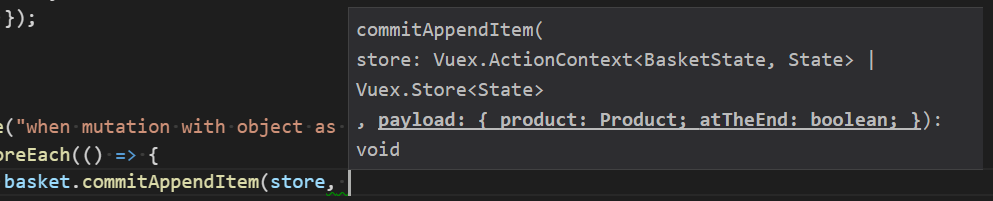

# Vuex-Typescript

A simple way to get static typing, static code analysis and intellisense with Vuex library.



We get full end-to-end compile-time safety and code navigability:
* No string literals or constants for action/mutation/getter names
* No action/mutation/getter misuse by providing wrong payload type
* Intellisense giving unambiguous hints on what type of payload or getter arguments is expected
* Refactoring made easy
* Supports vuex with and without modules (though use of modules and namespaces seems to produce better structured code).

## The idea

This library does not change the way how vuex handlers are defined (in particular it does not make you 
to use classes (though it does not stop you, either).

With this library you change the way how you *call* the store, once you have its instance: you **don’t use store’s 
compile-time-unsafe methods** and you use **strongly typed *accessors*** instead. This approach is remotely similar to the pattern of 
[Redux Action Creators](http://redux.js.org/docs/basics/Actions.html#action-creators), though much less boilerplate is needed thanks 
to higher-order functions provided by this library which do the dull work.

## Example 

Full working example available [here](src/tests/withModules/store/basket/basket.ts). Excerpt:

```js
import { ActionContext, Store } from "vuex";
import { getStoreAccessors } from "vuex-typescript";
import { State as RootState } from "../state";
import { BasketState, Product, ProductInBasket } from "./basketState";

// This part is a vanilla Vuex module, nothing fancy:

type BasketContext = ActionContext<BasketState, RootState>;

export const basket = {
    namespaced: true,

    state: {
        items: [],
        totalAmount: 0,
    },

    getters: {
        getProductNames(state: BasketState) {
            return state.items.map((item) => item.product.name);
        },
		...
    },

    mutations: {
        appendItem(state: BasketState, item: { product: Product; atTheEnd: boolean }) {
            state.items.push({ product: item.product, isSelected: false });
        },
		...
    },

    actions: {
        async updateTotalAmount(context: BasketContext, discount: number): Promise<void> {
            const totalBeforeDiscount = readTotalAmountWithoutDiscount(context);
            const totalAfterDiscount = await callServer(totalBeforeDiscount, discount);
            commitSetTotalAmount(context, totalAfterDiscount);
        },
		...
    },
};

// This is where the vuex-typescript specific stuff begins:
//
// We want to expose static functions which will call get, dispatch or commit method
// on a store instance taking correct type of payload (or getter signature).
// Instead of writing these "store accessor" functions by hand, we use set of higher-order
// functions provided by vuex-typescript. These functions will produce statically typed
// functions which we want. Note that no type annotation is required at this point.
// Types of arguments are inferred from signature of vanilla vuex handlers defined above:

const { commit, read, dispatch } =
     getStoreAccessors<BasketState, RootState>("basket"); // We pass namespace here, if we make the module namespaced: true.

export const readProductNames = read(basket.getters.getProductNames);
export const dispatchUpdateTotalAmount = dispatch(basket.actions.updateTotalAmount);
export const commitAppendItem = commit(basket.mutations.appendItem);

```

## Functions or objects

This lib is deliberately designed with functions rather than classes. This does not stop you from grouping accessors into objects. 
Note however that this makes little sense as the accessors are loosely or not related to each other. 
Importing and using functions rather than objects makes it explicit which accessor you actually use rather than 
stating which accessor in an object you may be using.

## Contributing

```
npm run build
npm run build-watch

npm test
npm run test-watch
npm run test-debug
npm run coverage
```
